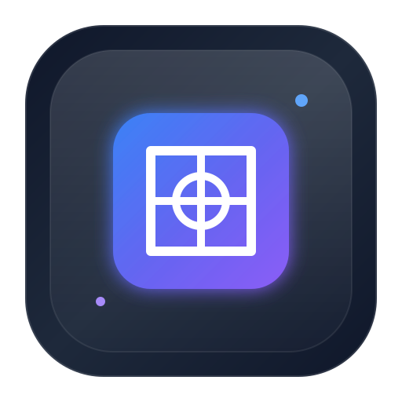

<div align="center">

  

  # WebDesk
  ### The Universal Linux Web Application Manager

  [](https://opensource.org/licenses/MIT)
  [](https://electronjs.org)
  [](https://react.dev)
  [](https://vitejs.dev)
  [](#supported-platforms)

  <p align="center">
    Turn any website (Slack, ChatGPT, Notion, GitHub, Discord, Jira) into a high-performance, isolated native desktop application with custom workspaces, session partitions, and native Linux XDG <code>.desktop</code> launcher integration.
  </p>

  [Key Features](#-key-features) •
  [Installation](#-installation) •
  [Quick Start](#-quick-start) •
  [Architecture](#-architecture) •
  [Documentation](#-documentation) •
  [Contributing](#-contributing)

</div>

---

## 🚀 Key Features

- 🛡️ **Isolated Session Profiles**: Run Personal, Work, College, Gaming, or custom profiles with completely separate cookies, cache, local storage, proxy servers, and session partitions (`persist:profile_id`).
- 🐧 **Linux XDG Desktop Launcher Integration**: Automatically generates standard `.desktop` application entries in `~/.local/share/applications/webdesk-[id].desktop` so installed web apps appear natively in GNOME Shell, KDE Launcher, Rofi, or system docks!
- 🗂️ **Custom Context Workspaces**: Organize applications into contexts like *Development*, *Social & Chat*, *AI Assistants*, and *Productivity*.
- ⚡ **Command Palette (`Ctrl+K`)**: Keyboard-first navigation to launch apps, switch workspaces, or trigger commands instantly.
- 🎨 **Modern Arc & VS Code Inspired UI**: Customizable dark/light modes, HSL tailored accent colors, subtle glassmorphism blur effects, and fluid micro-animations.
- 🔍 **Favicon & Metadata Scraping**: Auto-detects website titles and high-resolution favicons when installing web apps.
- 📦 **Backup & Restore**: Export and import complete WebDesk SQLite database backups in JSON format.
- 🔌 **Extensible Plugin Framework**: Built-in plugin manager API foundation allowing third-party extensions.

---

## 🐧 Supported Platforms

| Operating System | Package Format | Status |
| :--- | :--- | :--- |
| **Ubuntu / Debian / Pop!_OS / Zorin OS** | `.deb` package | ✅ Supported |
| **Fedora / openSUSE / RHEL / Kali Linux** | `.rpm` package | ✅ Supported |
| **Arch Linux / Manjaro / Linux Mint** | `AppImage` / Portable | ✅ Supported |
| **Windows 10 / 11** | NSIS Installer / Portable `.exe` | ✅ Supported |


---

## 📥 Installation

### Debian / Ubuntu (`.deb`)
```bash
sudo dpkg -i webdesk_1.0.0_amd64.deb
```

### Fedora / RHEL (`.rpm`)
```bash
sudo rpm -i webdesk-1.0.0.x86_64.rpm
```

### Universal Linux AppImage
```bash
chmod +x WebDesk-1.0.0.AppImage
./WebDesk-1.0.0.AppImage
```

---

## 💻 Quick Start (Development)

### Prerequisites
- **Node.js**: `>= 20.0.0`
- **NPM**: `>= 10.0.0`

### Setup
```bash
# 1. Clone the repository
git clone https://github.com/mr-harish-0706/WebDesk.git
cd WebDesk

# 2. Install dependencies
npm install

# 3. Launch application in development mode
npm start

# 4. Run type checking
npm run typecheck

# 5. Build production installers
npm run build
```

---

## 🏗️ Architecture Overview

```
               ┌─────────────────────────────────────────────────────────┐
               │                    WebDesk Frontend                     │
               │  React 18 + TypeScript + Tailwind CSS + Lucide + Framer │
               │     Workspace Bar │ Command Palette │ Settings │ Grid    │
               └────────────────────────────┬────────────────────────────┘
                                            │ IPC Bridge (type-safe contextBridge)
               ┌────────────────────────────┴────────────────────────────┐
               │                   Electron Main Process                 │
               │                                                         │
               │  ┌────────────────────┐      ┌───────────────────────┐  │
               │  │  Session Manager   │      │  SQLite DB Engine     │  │
               │  │ (Isolated Partitions│      │ (Apps, Workspaces,    │  │
               │  │ per Profile)       │      │  Profiles, Settings)  │  │
               │  └─────────┬──────────┘      └───────────┬───────────┘  │
               │            │                             │              │
               │  ┌─────────┴──────────┐      ┌───────────┴───────────┐  │
               │  │ Linux Desktop      │      │ Plugin API Engine &   │  │
               │  │ Launcher Integration│      │ System Tray Manager   │  │
               │  └────────────────────┘      └───────────────────────┘  │
               └─────────────────────────────────────────────────────────┘
```

---

## 📚 Documentation Index

- 📖 [ARCHITECTURE.md](file:///home/harish/Desktop/webApp/ARCHITECTURE.md) — Technical architecture & security model
- 📖 [DEVELOPER_GUIDE.md](file:///home/harish/Desktop/webApp/DEVELOPER_GUIDE.md) — Developer setup & folder guide
- 📖 [API.md](file:///home/harish/Desktop/webApp/API.md) — `window.webdesk` ContextBridge API reference
- 🎨 [Brand Guidelines.md](file:///home/harish/Desktop/webApp/Brand_Guidelines.md) — Design system & color tokens
- 🛡️ [SECURITY.md](file:///home/harish/Desktop/webApp/SECURITY.md) — Vulnerability reporting policy
- 🗺️ [ROADMAP.md](file:///home/harish/Desktop/webApp/ROADMAP.md) — Project roadmap & feature milestones
- 🤝 [CONTRIBUTING.md](file:///home/harish/Desktop/webApp/CONTRIBUTING.md) — Contributor guide & code standards

---

## 📄 License

WebDesk is open-source software licensed under the [MIT License](LICENSE).
